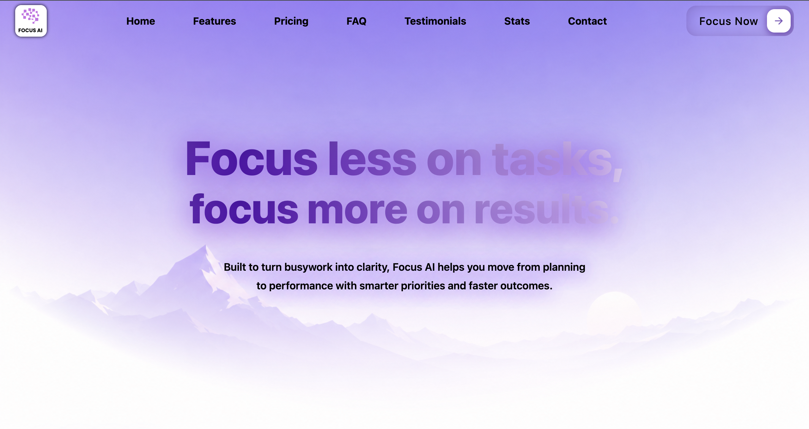
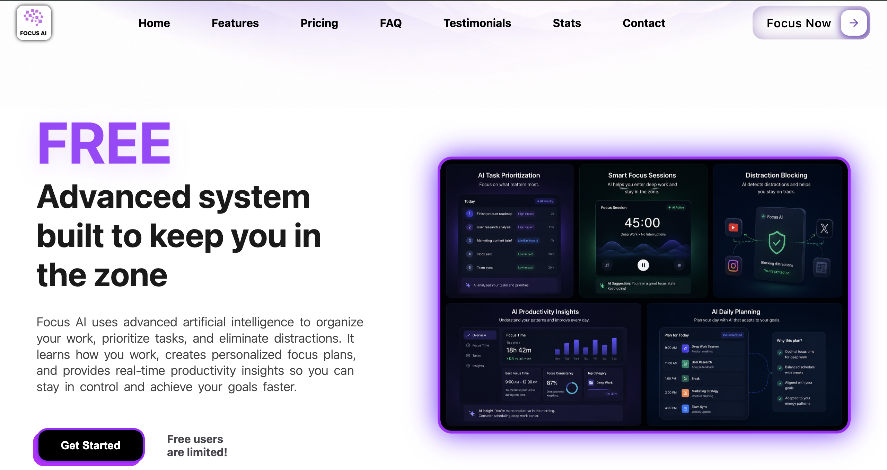
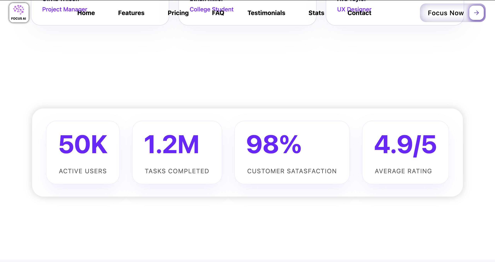
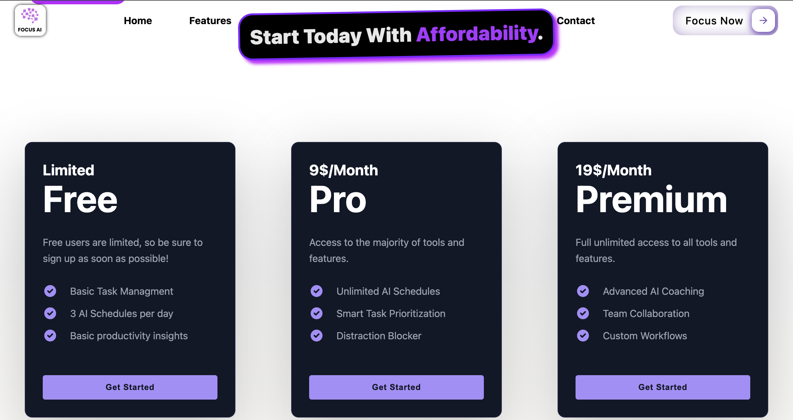
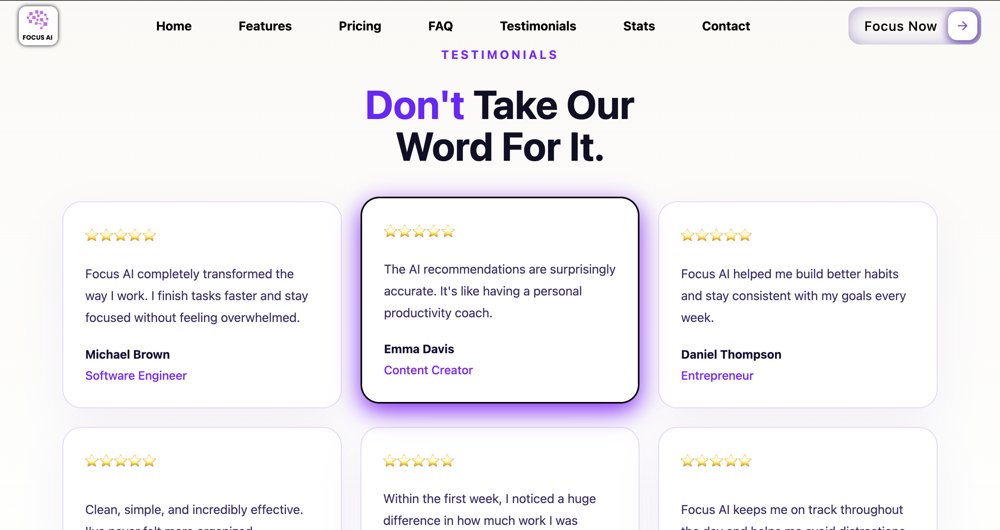
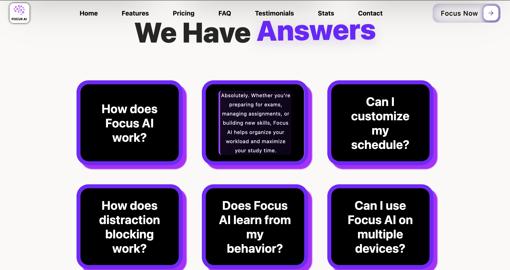
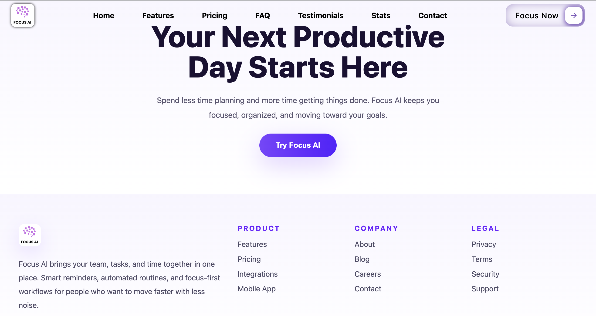

# 🧠 Focus AI (June 3rd - 6th 2026)

A modern AI-powered productivity landing page built with HTML and CSS.

Focus AI is a fictional SaaS product designed to help users organize tasks, eliminate distractions, and improve productivity through artificial intelligence.

⚠️ Focus AI is not a real product (yet). It’s a fake startup I built to practice frontend development, UI design, and making things look way more expensive than they actually are.

🔗 Live Demo: https://davi-sousa-queiroz.github.io/focusai/

⸻

## Preview 📷

### Hero Section

### Features Section

### Stats Section

### Pricing Section

### Testimonials Section

### FAQ Section

### Footer Section

## 🚀 Features

### 🎯 Hero Section

* Animated gradient heading
* Floating hero content
* Strong call-to-action
* Modern SaaS design

### ⚡ Features Section

* Product dashboard preview
* Interactive hover effects
* Product explanation layout

### 💳 Pricing Section

* Three pricing plans
* Interactive pricing cards
* Hover animations and transitions

### ❓ FAQ Section

* CSS flip-card effect
* Grid layout
* Interactive FAQ system

### ⭐ Testimonials Section

* Customer review cards
* Hover effects
* Modern card design

### 📊 Statistics Section

* Animated statistic cards
* Productivity-focused metrics
* Interactive layout

### 📣 CTA Section

* Conversion-focused call-to-action
* Custom button styling

### 🦶 Footer

* Multi-column footer
* Product, company, and legal links
* Professional SaaS structure

⸻

## 🛠️ Built With

* HTML5
* CSS3
* Flexbox
* CSS Grid
* CSS Animations
* CSS Transitions
* Git
* GitHub Pages

⸻

## 🎨 Design Highlights

Some of the design techniques used throughout the project include:

* Animated gradient text
* Floating hero animations
* FAQ flip-card animations
* Hover effects
* Smooth transitions
* Interactive pricing cards
* Animated statistics section
* Modern SaaS-inspired layouts
* Glassmorphism-inspired styling
* Layered shadows and gradients

⚠️ Some animations and transitions were created with the help of AI while I was still learning how they worked. I used this project to experiment with more advanced CSS effects and understand how they function behind the scenes.

⸻

## 📚 What I Learned

This project taught me a lot more than I expected.

When I started, the goal was just to build a fake AI landing page.

By the end, I had practiced:

* Advanced Flexbox layouts
* CSS Grid systems
* Hover interactions
* Animations and keyframes
* Transitions
* Visual hierarchy
* Landing page structure
* Better spacing and layout decisions
* Building larger projects without tutorials

Most importantly, I learned that building one larger project teaches more than building ten tiny ones.

⸻

## 📈 Project Stats

* ⏱️ Around 4 days of development
* 📝 Around 1500 lines of code
* 🎨 Countless design tweaks
* ☕ Probably too much caffeine
* 😭 Several moments of questioning my life choices
* 🚀 My biggest frontend project so far

⸻

## 🔮 Future Improvements

Potential future upgrades:

* Full mobile responsiveness
* JavaScript functionality
* Real authentication pages
* Working pricing toggle
* Scroll-triggered animations
* Backend integration
* Actual AI functionality (crazy concept, I know)

⸻

## 💭 Note To Future Me

Hey future Davi,

If you’re looking at this project and seeing a hundred things you’d change, that’s a good sign.

It means you improved.

This was the first project that genuinely felt like a real product instead of just another practice website.

Keep building, keep learning, and remember:

Every developer has old projects they cringe at.

This one just happens to be yours.

# — Davi
